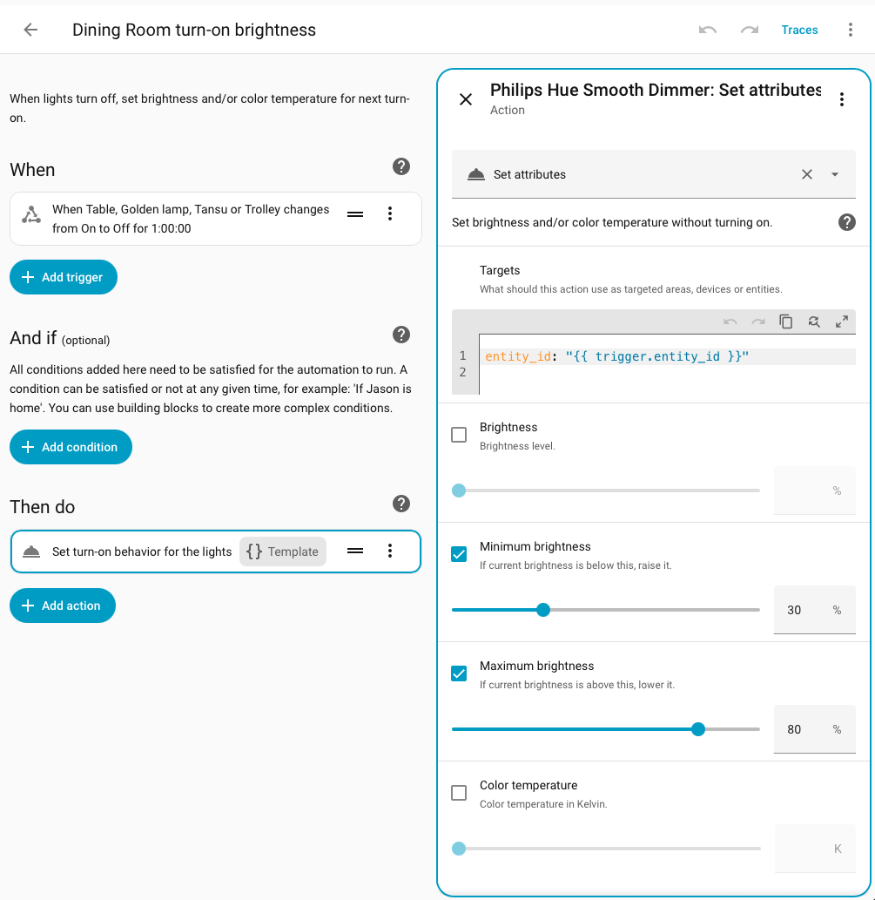

# Philips Hue Smooth Dimmer

[](https://hacs.xyz/) 

This integration extends the core Philips Hue integration and lets you:
* Use third-party buttons to dim your Hue lights smoothly.
* Change turn-on brightness, color temp or color while lights are off.

## How It Helps You 🔅💡🔆

* **Silky Smooth:** Dimming is continuous and precise. No more jittery repeat loops and dimming overshoots.
* **Predictable:** Prepare your lights to turn on how you want them. Fewer dazzles, fumbles in the dark and unwanted color changes when lights turn on.
* **Zero Setup:** Connects to your lights automatically via the core Philips Hue integration.

## Get Started

### Requirements
* **[Philips Hue integration](https://www.home-assistant.io/integrations/hue)**
* Philips Hue Bridge V2 or Pro (V3)

### Install from HACS
1. Open the Philips Hue Smooth Dimmer HACS repository

[](https://my.home-assistant.io/redirect/hacs_repository/?owner=jasonmx&repository=philips-hue-smooth-dimmer&category=integration)

2. Click **Download**
3. Restart Home Assistant
4. Add the integration

[](https://my.home-assistant.io/redirect/config_flow_start/?domain=hue_dimmer)

## Usage

### Smooth Dimming

Use these 3 actions in the HA Automations editor:

| Action | Description |
| :--- | :--- |
| `hue_dimmer.raise` | Start raising brightness |
| `hue_dimmer.lower` | Start lowering brightness |
| `hue_dimmer.stop` | Freeze brightness |

| Field | Actions | Description |
| :--- | :--- | :--- |
| `target` | all | Hue lights and groups (required) |
| `sweep_time` | raise, lower | Duration of a full 0–100% sweep (default 5s) |
| `limit` | raise | Max brightness (default 100%) |
| `limit` | lower | Min brightness (default 0%). Light turns off at 0%. Choose 0.4%+ to keep light on |

To dim multiple lights perfectly, target a **Hue Group** instead of separate lights. Your Hue Bridge will then sync them with group-wide Zigbee messages.

#### YAML Example: Two-button dimmer

```yaml
left_button_held:
  - action: hue_dimmer.lower

right_button_held:
  - action: hue_dimmer.raise

buttons_released:
  - action: hue_dimmer.stop
```

---

### Set Brightness, Color Temp Or Color While Light Is Off

* Reduce turn-on surprises after lights are turned off very bright or very dim
* Achieve consistent turn-on behavior across your home and automations

| Action | Description |
| :--- | :--- |
| `hue_dimmer.set_attributes` | Set brightness, color temp, or color without turning on |
| `hue_dimmer.get_attributes` | Get brightness, color temp, or color, even while a light is off |

| Field | Description |
| :--- | :--- |
| `target` | Hue lights and groups (required) |
| `brightness` | Brightness level (%) |
| `min_brightness` | Enforce a minimum brightness (%) |
| `max_brightness` | Enforce a maximum brightness (%) |
| `color_temp_kelvin` | Color temperature (K) |
| `xy_color` | CIE XY color as `[x, y]` |
| `hs_color` | Color as `[hue, saturation]` (0–360, 0–100) |
| `rgb_color` | Color as `[r, g, b]` (0–255 each) |

#### GUI Automation Example: When lights turn off for an hour, set brightness for next turn-on



To set up this automation:

1. Go to **Settings > Automations**
2. Click **Create automation** and **Create new automation**
3. Open the ⋮ menu and switch view to **Edit in YAML**
4. Copy-paste the YAML below (replacing HA's placeholder YAML)
5. Switch view back to **Edit in visual editor**
6. Select the ["When something changes" entry](examples/update-lights-after-turn-off--step-1.png?raw=true) and add your Hue light(s).
7. Select the "Set turn-on behavior" entry and choose your settings. Don't touch the Targets section.
8. Click **Save**

```yaml
description: >
  When lights turn off, set brightness and/or color temperature for next turn-on.
triggers:
  - trigger: state
    entity_id: []
    from:
      - "on"
    to:
      - "off"
    for:
      hours: 1
      minutes: 0
      seconds: 0
actions:
  - action: hue_dimmer.set_attributes
    target:
      entity_id: "{{ trigger.entity_id }}"
    data:
      max_brightness: 80
      min_brightness: 30
      alias: Set turn-on behavior for the lights
mode: parallel
max: 10
```

If you add more than 10 lights, increase "max: 10" accordingly.

</details>

***

## Uninstall

This integration follows standard integration removal.

1. Open the integration

[](https://my.home-assistant.io/redirect/integration/?domain=hue_dimmer)

2. Open the ⋮ menu and choose **Delete**
